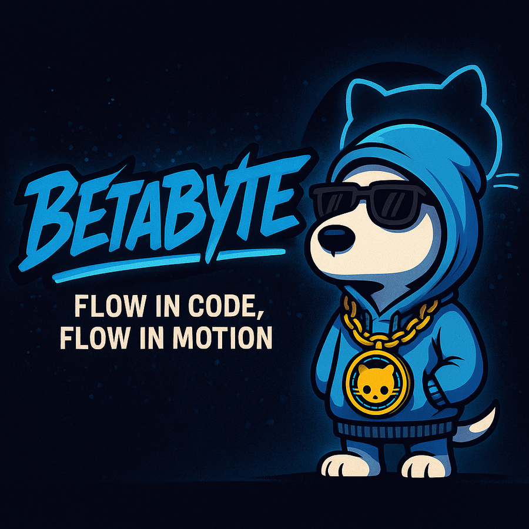

## 🏅 Certifications & Achievements

<!-- Header Section -->

  

<h2 style="color: #fff; max-width: 100%; margin: 0 0 1em;">🚀 Welcome to my GitHub journey!</h2>

<!-- Content Section -->
<h3 style="color: #fff;">My GitHub Journey</h3>

  This profile is my creative corner a space to showcase what I’ve been learning and building
  as I move through the GitHub certification path. I’ve completed Foundations and am
  now expanding into administration, automation, and security.

  I maintain other accounts for different projects and teamwork, but this one’s built
  to highlight growth, creativity, and personal style proving that solid DevOps
  practices and good design can go hand in hand.

<!-- Badge Section -->
<h3 style="color: #fff;">Certifications</h3>

  

  Verified via <a href="https://www.credly.com/" style="color: #555; text-decoration: none;">Credly</a>

<!-- Footer Section -->

  Always Learning · Always Shipping · Always Improving

